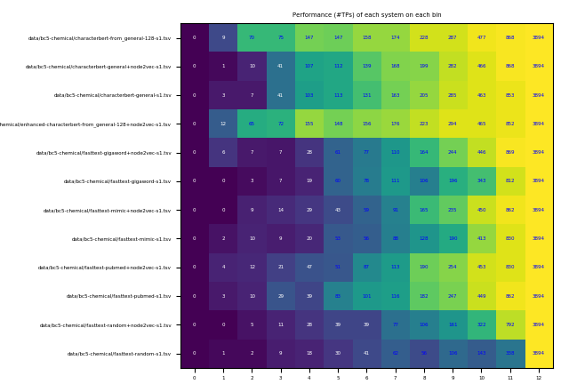

# Differential evaluation

A framework to compare a set of system predictions by defining a difficulty for each input example.

## Core algorithm

Input = one row per gold standard item, one column per system prediction:
in each cell, 1 if system obtained a true positive (TP) for this item, 0 otherwise.

For each input data item, computes how many systems obtained a TP for it.
Creates as many bins as there are systems (S) plus one (for zero).

  - bin N holds the number of data items for which exactly N systems obtained a TP:
  - bin 0 describes the set of most difficult data items, bin S+1 the easiest data items.

We can then describe a data item by the bin that contains it: its difficulty.
We can finally summmarize a system's result by its number of TPs in each bin,
or by the proportion of items in that bin for which it produced a TP.

## Creating and plotting bins as a (colored) table
### Python example: creating bins from a synthetic input
    # create random system results drawn from a binomial distribution:
    n_sys = 10
    n_data = 100
    proba_tp = 0.8
    rng = np.random.default_rng()
    data = rng.binomial(1, proba_tp, (n_sys, n_data))

    # create bins and system statistics per bin
    r = TPS(data)
    r.compute_bins()
    print(r.results)
    print(r.bins)
    print(r.nps_per_bin)
    print(np.round(r.prop_nps_per_bin, decimals=2)*100)
    print(np.sum(r.results, axis=1))

### Command-line example: creating and plotting bins from a table of system true positives (--plot-bins)

Sample input:

|----|----|----|----|----|----|----|----|----|
|1|1|1|1|1|1|1|1|1|
|1|1|1|1|1|1|1|1|1|
|1|1|1|1|1|1|1|1|1|
|1|0|0|1|1|0|0|1|0|
|1|0|0|1|0|0|0|1|0|
|1|0|0|0|0|0|0|0|0|

Command line:

    python results.py --system-names A1,A2,B1,B2,C1,C2,D,E1,E2 --plot-bins outputs/plot-HU.pdf data/HU-eval-dist-tps.tsv.gz

This creates the following (bin x system) plot:

Input examples may be included as the first column of the input table, and system names as the first row of the input table (data/bc5-c-models.tsv), using --with-inputs (--displayed-values number displays raw counts instead of percentages in each bin):

Sample input:

|input|s1|s2|s3|s4|s5|s6|s7|s8|s9|s10|s11|s12|
|----|----|----|----|----|----|----|----|----|----|----|----|----|
|[...]|
|762_levodopa|1|1|1|1|1|1|1|1|1|1|1|1|
|1004_cyclophosphamide|1|1|1|1|1|1|1|1|1|1|1|1|
|1032_cyclophosphamide|1|1|1|1|1|1|1|1|1|1|1|1|
|1034_cyp|1|1|1|1|0|0|1|1|0|0|1|0|
|1105_cyp|1|0|1|1|0|0|1|0|0|0|1|0|
|1128_cyp|1|0|1|1|0|0|0|0|0|0|0|0|
|[...]|

    python results.py --with-inputs --displayed-values number --plot-bins outputs/bc5-c-models.pdf data/bc5-c-models.tsv.gz >outputs/bc5-c-models.out

This creates the following plot:

### Add bin ID to input table (--annotate-bins)

    python results.py --with-inputs --displayed-values number --annotate-bins outputs/bc5-c-models-bins.tsv data/bc5-c-models.tsv.gz

Sample output:

|input|s1|s2|s3|s4|s5|s6|s7|s8|s9|s10|s11|s12|bin|
|----|----|----|----|----|----|----|----|----|----|----|----|----|----|
|[...]|
|762_levodopa|1|1|1|1|1|1|1|1|1|1|1|1|12|
|1004_cyclophosphamide|1|1|1|1|1|1|1|1|1|1|1|1|12|
|1032_cyclophosphamide|1|1|1|1|1|1|1|1|1|1|1|1|12|
|1034_cyp|1|1|1|1|0|0|1|1|0|0|1|0|7|
|1105_cyp|1|0|1|1|0|0|1|0|0|0|1|0|5|
|1128_cyp|1|0|1|1|0|0|0|0|0|0|0|0|3|
|[...]|

The resulting table can be explored with your preferred tool, for instance to study correlations of inputs and bins, or to compare systems within bins.

## Creating a True Positive table from CONLL-style tsv input

The input TSV file must include a header line and either contain:

- exactly three columns containing token, gold, and system prediction
- any number of columns in any order, with column labels including "input", "gold", and "system"

### Converter from CONLL format: example call

Prepare a TP table for the token-level predictions of 12 NER models on the Biocreative 5 CDR chemical and disease datasets:

    python readers.py --output-file data/bc5-c-models.tsv.gz data/bc5-chemical/*.tsv.gz
    python readers.py --output-file data/bc5-d-models.tsv.gz data/bc5-disease/*.tsv.gz
